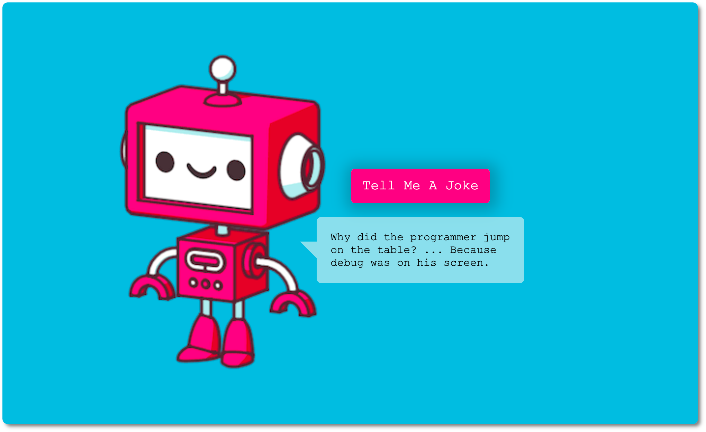

# Joke Teller



Simple application that tells random developer jokes to the user whenever the` "Tell Me A Joke"` button is clicked on. The joke is both displayed on screen in a speech bubble as well as played by a robotic voice. APIs used for this project:

- [joke API](https://sv443.net/jokeapi/v2/)
- [text-to-speech API](http://www.voicerss.org/api/)


<br>

---

## Learning outcomes

1. Using [joke API](https://sv443.net/jokeapi/v2/)
2. Using [text-to-speech API](http://www.voicerss.org/api/)
3. Manipulate background of container element
4. Hiding an API key 👉🏻 it should go in the Backend
5. Using `ended` event


<br>

----

## Process

<br>


1. Call a joke API to get a random joke → 
2. Pass to a text to speech API that will read out loud the joke 
3. Display joke on screen


<br>

### Text-To-Speech API

The `voice.js` file contains the `VoiceRSS` object that allows us to use the `speech` method that takes a string and returns an audio.

**script.js**

```js
// Passing Joke to VoiceRSS API
function tellMeAJoke(joke) {
  VoiceRSS.speech({
    key: '...',
    src: joke, // <-- our joke!
    hl: 'en-us',
    v: 'Linda',
    r: 0,
    c: 'mp3',
    f: '44khz_16bit_stereo',
    ssml: false,
  });
}
```

<br>

### Joke API

<br>

We create a function that gets the jokes from the API:

**script.js**

```js
// Get Jokes from Joke API
async function getJokes() {
  let joke = '';
  const apiUrl = 'https://sv443.net/jokeapi/v2/joke/Programming'
  
  try {
    const response = await fetch(apiUrl);
    const data = await response.json();
    
    // Check if the joke is a single or two parts joke
    if (data.setup) {
      joke = `${data.setup} ... ${data.delivery}`;
    } else {
      joke = `${data.joke}`;
    }
    
    // Display text
    renderJoke(joke);

    // Text-To-Speech API
    tellMeAJoke(joke);

    // Disable Button While Audio Playing
    toggleButton();
  } catch (error) {
    console.log('Ooops, there was an error: ' + error);
  }
}
```

> ⚠️ Because we have both single jokes and jokes with a sept and delivery, we make sure in both cases the text is saved in the variable `joke` so that we can pass in to the other API.

<br>

### Manipulating the DOM (button)

```js
// Event Listeners
button.addEventListener('click', getJokes)
```

In order to avoid the user clicking multiple times on the user and get jokes overlap, we disable the button until the joke is finished. We use `ended` event (fires when the current playlist is ended)

```js
audio.addEventListener('ended', toggleButton);

// Disable/Enable Button
function toggleButton() {
  button.disabled = !button.disabled;
}
```

⚠️ we also add it when the audio is playing

<br >

---

